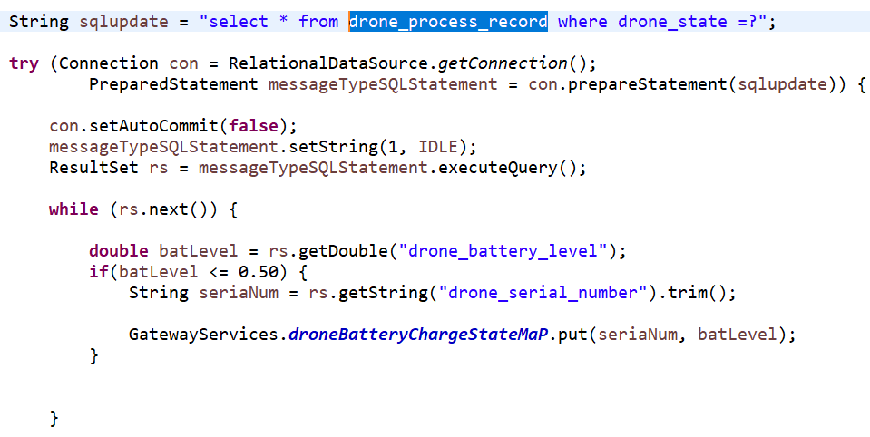
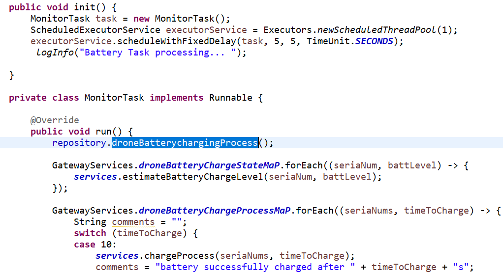
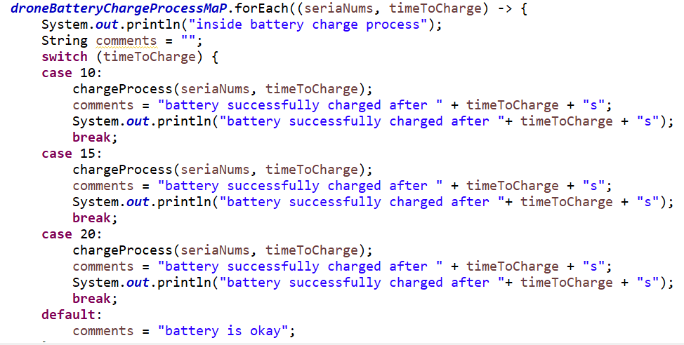
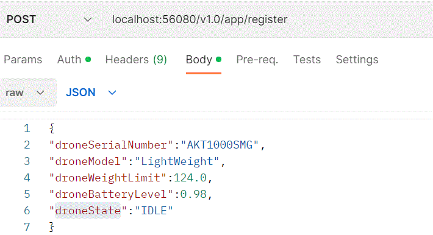

# Drone Services

## Drones

[[_TOC_]]

---

:scroll: **START**

### Introduction

There is a major new technology that is destined to be a disruptive force in the field of transportation: **the drone**. Just as the mobile phone allowed developing countries to leapfrog older technologies for personal communication, the drone has the potential to leapfrog traditional transportation infrastructure.

Useful drone functions include delivery of small items that are (urgently) needed in locations with difficult access.

---

### Task description

We have a fleet of **10 drones**. A drone is capable of carrying devices, other than cameras, and capable of delivering small loads. For our use case **the load is medications**.

A **Drone** has:
- serial number (100 characters max);
- model (Lightweight, Middleweight, Cruiserweight, Heavyweight);
- weight limit (500gr max);
- battery capacity (percentage);
- state (IDLE, LOADING, LOADED, DELIVERING, DELIVERED, RETURNING).

Each **Medication** has: 
- name (allowed only letters, numbers, ‘-‘, ‘_’);
- weight;
- code (allowed only upper case letters, underscore and numbers);
- image (picture of the medication case).

Develop a service via REST API that allows clients to communicate with the drones (i.e. **dispatch controller**). The specific communicaiton with the drone is outside the scope of this task. 

The service should allow:
- registering a drone;
- loading a drone with medication items;
- checking loaded medication items for a given drone; 
- checking available drones for loading;
- check drone battery level for a given drone;

> Feel free to make assumptions for the design approach. 

---

### Requirements

While implementing your solution **please take care of the following requirements**: 

#### Functional requirements

- There is no need for UI;
- Prevent the drone from being loaded with more weight that it can carry;
- Prevent the drone from being in LOADING state if the battery level is **below 25%**;
- Introduce a periodic task to check drones battery levels and create history/audit event log for this.

---

#### Non-functional requirements

- Input/output data must be in JSON format;
- Your project must be buildable and runnable;
- Your project must have a README file with build/run/test instructions (use DB that can be run locally, e.g. in-memory, via container);
- Required data must be preloaded in the database.
- JUnit tests are optional but advisable (if you have time);
- Advice: Show us how you work through your commit history.

---

:scroll: **END** 


## Process of Battery Recharging
there is a process in place that allow the batteries to be charge
using a task time procedure.
The Gateway service class runs the process

At the initialiseGateway methos the process

repository.droneBatterychargingProcess() select all the Batteries within the database table drone_process_record and adds this to the hashmap that uses the list to start the charging process



SmppSessionMonitor
the process also is continued in the SmppSessionMonitor class 
## API Reference

#### Register a New Drone

```http
 POST localhost:56080/v1.0/app/register
```


| Parameter | Type     | Description                |
| :-------- | :------- | :------------------------- |
| `droneSerialNumber` | `string` | **Required**. Your API key |
| `droneModel` | `string` | **Required**. Your API key |
| `droneWeightLimit` | `double` | **Required**. Your API key |
| `droneBatteryLevel` | `double` | **Required**. Your API key |
| `droneState` | `string` | **Required**. Your API key |

#### LOAD MEDICATION

```http
  GET http://localhost:56080/v1.0/app/loadMedications
```
the endpoint runs a process that will use the attached csv to update the
database with medication.[testingfolder/medications.csv]

#### List Available Drone

```http
  GET http://localhost:56080/v1.0/app/getListOfDrones
```


#### load Drone with Available Medication
the process involves getting the available drone to load
medication and the drone will get to to update the system with very process
i.e. from LOADING TO RETURNING state.

```http
 POST localhost:56080/v1.0/app/drone/load
```
{ 
  "droneSerialNumber":"AKT1000SMG",
  "medCode":"GDT6688IOP-0",
  "sourceLocation":"Koprivshtitsa",
  "destinationLocation":"Sozopol" 
}


LOADING
| Parameter | Type     | Description                |
| :-------- | :------- | :------------------------- |
| `droneSerialNumber` | `string` | **Required**. Your API key |
| `medCode` | `string` | **Required**. Your API key |
| `sourceLocation` | `string` | **Required**. Your API key |
| `destinationLocation` | `string` | **Required**. Your API key |


After the update from the IDLE state to RETURNING state

#### load Drone process to update system to LOADED
the process involves getting the available drone to load
medication and the drone will get to to update the system with very process
i.e. from LOADING TO RETURNING state.

```http
 POST localhost:56080/v1.0/app/drone/loaded
```

{ 
  "droneSerialNumber":"AKT1000SMG",
  "medCode":"GDT6688IOP-0",
  "sourceLocation":"Koprivshtitsa",
  "destinationLocation":"Sozopol" 
}
LOADED
| Parameter | Type     | Description                |
| :-------- | :------- | :------------------------- |
| `droneSerialNumber` | `string` | **Required**. Your API key |
| `medCode` | `string` | **Required**. Your API key |
| `sourceLocation` | `string` | **Required**. Your API key |
| `destinationLocation` | `string` | **Required**. Your API key |

#### load Drone process to update system to DELIVERING
the process involves getting the available drone to load
medication and the drone will get to to update the system with very process
i.e. from LOADING TO RETURNING state.

```http
 POST localhost:56080/v1.0/app/drone/delivering
```
{ 
  "droneSerialNumber":"AKT1000SMG",
  "medCode":"GDT6688IOP-0",
  "sourceLocation":"Koprivshtitsa",
  "destinationLocation":"Sozopol" 
}


DELIVERING
| Parameter | Type     | Description                |
| :-------- | :------- | :------------------------- |
| `droneSerialNumber` | `string` | **Required**. Your API key |
| `medCode` | `string` | **Required**. Your API key |
| `sourceLocation` | `string` | **Required**. Your API key |
| `destinationLocation` | `string` | **Required**. Your API key |
#### load Drone process to update system to DELIVERED
the process involves getting the available drone to load
medication and the drone will get to to update the system with very process
i.e. from LOADING TO RETURNING state.

```http
 POST localhost:56080/v1.0/app/drone/delivered
```
{ 
  "droneSerialNumber":"AKT1000SMG",
  "medCode":"GDT6688IOP-0",
  "sourceLocation":"Koprivshtitsa",
  "destinationLocation":"Sozopol" 
}
DELIVERED
| Parameter | Type     | Description                |
| :-------- | :------- | :------------------------- |
| `droneSerialNumber` | `string` | **Required**. Your API key |
| `medCode` | `string` | **Required**. Your API key |
| `sourceLocation` | `string` | **Required**. Your API key |
| `destinationLocation` | `string` | **Required**. Your API key |

#### load Drone process to update system to DELIVERED
the process involves getting the available drone to load
medication and the drone will get to to update the system with very process
i.e. from LOADING TO RETURNING state.

```http
 POST localhost:56080/v1.0/app/drone/returning
```
{ 
  "droneSerialNumber":"AKT1000SMG",
  "medCode":"GDT6688IOP-0",
  "sourceLocation":"Koprivshtitsa",
  "destinationLocation":"Sozopol" 
}
RETURNING
| Parameter | Type     | Description                |
| :-------- | :------- | :------------------------- |
| `droneSerialNumber` | `string` | **Required**. Your API key |
| `medCode` | `string` | **Required**. Your API key |
| `sourceLocation` | `string` | **Required**. Your API key |
| `destinationLocation` | `string` | **Required**. Your API key |


## Deployment
A package is provide that can easily be run
the folder is dronePackage
from the folder path

Before you can run the project you need to run the script that 
will create the table

on postgre create a table
CREATE DATABASE drone-service
- run the script in 

psql - U postgres -h localhost -p 5432 < [path to the scripts]
[dbscripts/dronedbScripts.sql]

that will create the database and the table
To deploy this project run

```bash
  run the jar file
  java -jar droneServicesTaskV1.jar

```

